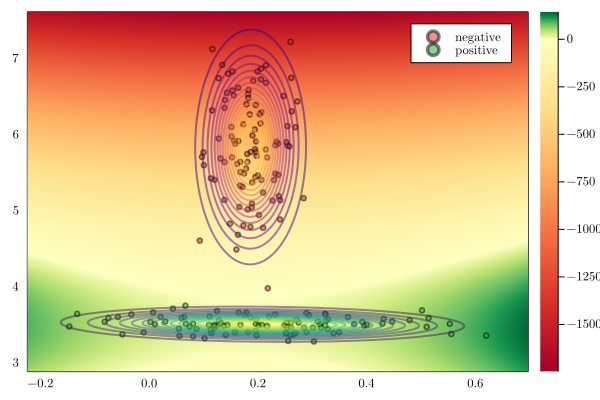

# GaussianDiscriminantAnalysis.jl
[](https://github.com/mossr/GaussianDiscriminantAnalysis.jl/actions/workflows/CI.yml)
[](https://codecov.io/gh/mossr/GaussianDiscriminantAnalysis.jl)

<p align="center">
    
</p>

## Installation
```julia
] add https://github.com/mossr/GaussianDiscriminantAnalysis.jl
```

## Quadratic discriminant analysis
```julia
using GaussianDiscriminantAnalysis

# 𝒟::Vector{Tuple{Array, Int}}
𝒟 = generate_example_data(100, seed=0xC0FFEE)
predict, mv₀, mv₁ = qda(𝒟)
```

## Linear discriminant analysis
```julia
predict, mv₀, mv₁ = lda(𝒟)
```

## Plotting

```julia
gdaplot(𝒟;
        soft=true,            # soft/hard prediction boundary
        use_qda=true,         # QDA or LDA
        k=1,                  # specify which class k to share covariance (LDA only)
        rev=false,            # reverse "positive" and "negative"
        heatmap=false,        # use heatmap instead of filled contours
        levels=100,           # number of levels for the filled contours
        show_axes=true,       # toggle displaying of axes
        subplots=false,       # include single-dimensional Gaussian fits in subplots
        show_svm=false,       # show SVM decision boundary
        show_analysis=false,  # print out goodness of prediction
        show_legend=true,     # toggle showing of legend
        return_predict=false) # return (fig, predict) instead of just (fig)
```

### Plotting examples

```jula
gdaplot(𝒟)
```
<p align="center">
    
</p>

```jula
gdaplot(𝒟, heatmap=true)
```
<p align="center">
    
</p>

```jula
gdaplot(𝒟, rev=true)
```
<p align="center">
    
</p>

```jula
gdaplot(𝒟, subplots=true)
```
<p align="center">
    
</p>

```jula
gdaplot(𝒟, show_svm=true)
```
<p align="center">
    
</p>

```jula
gdaplot(𝒟, soft=false)
```
<p align="center">
    
</p>

```jula
gdaplot(𝒟, use_qda=false)
```
<p align="center">
    
</p>

```jula
gdaplot(𝒟, use_qda=false, k=2)
```
<p align="center">
    
</p>

```jula
gdaplot(𝒟, use_qda=false, k=2, soft=false
```
<p align="center">
    
</p>


---

[Robert Moss](https://github.com/mossr)
